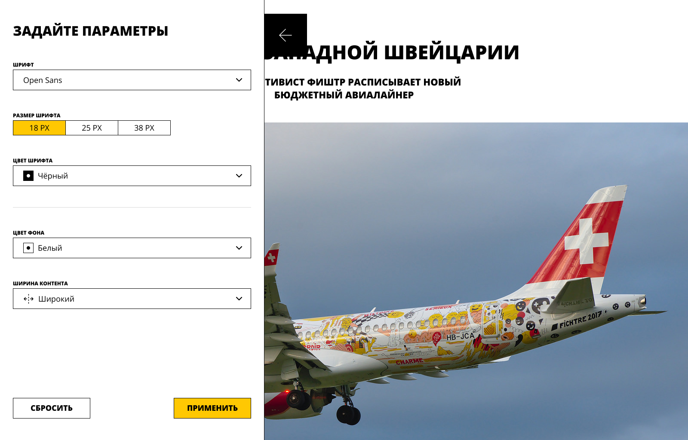

# Блог: кастомизация страницы

Интерактивная страница блога с выдвижной панелью настроек. Через боковую панель можно изменить шрифт, размер текста, цвет фона и другие параметры статьи. Настройки применяются через CSS-переменные после нажатия кнопки «Применить», сбрасываются кнопкой «Сбросить».

  

## Демо

**[https://vovchensky.github.io/blog-customizer/](https://vovchensky.github.io/blog-customizer/)**

## Технологии

- React (компонентный подход, состояния, обработчики событий)
- TypeScript
- Webpack
- CSS Modules (SCSS)
- CSS-переменные для кастомизации стилей
- Storybook (документация UI-компонентов)